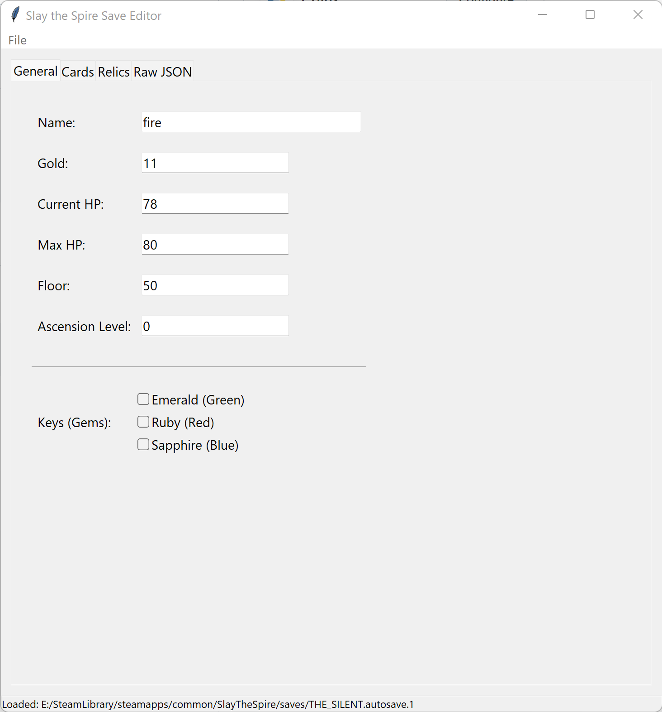
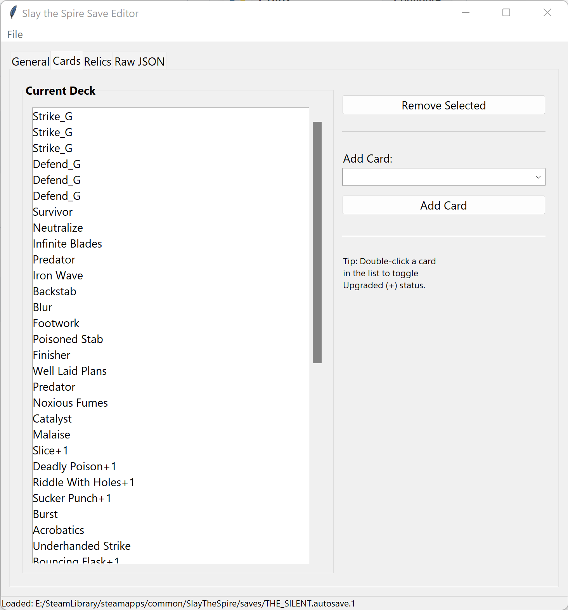
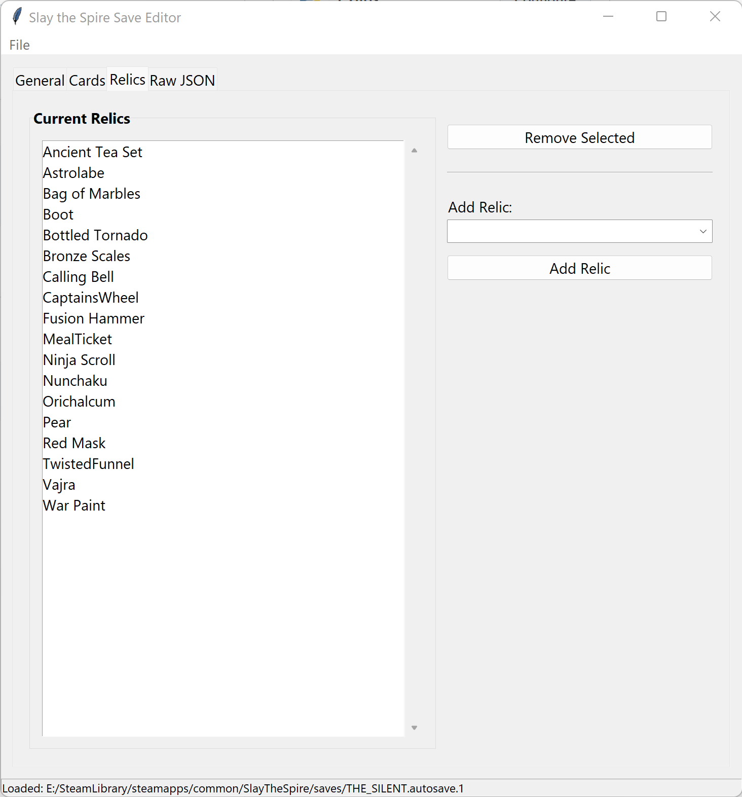

# Slay the Spire Save Editor (UI)

A comprehensive graphical save editor for *Slay the Spire*, written in Python. This tool allows you to easily modify your `.autosave` files to customize your run.

## Screenshots

<div align="center">
  
  
  
</div>

## Features

-   **General Stats Editor**: Modify Gold, Current HP, Max HP, Ascension Level, Floor number, and your character's display name.
-   **Deck Manager**: 
    -   Add any card from a searchable dropdown list.
    -   Remove unwanted cards.
    -   **Upgrade Toggle**: Double-click any card in your list to instantly upgrade (or downgrade) it.
-   **Relic Manager**: Add or remove any relic in the game.
-   **Key/Gem Toggles**: Easily enable the Emerald, Ruby, and Sapphire keys for Act 4 access.
-   **Raw JSON Editor**: For power users, a direct JSON view allows for manual edits of fields not covered by the UI (use with caution).
-   **High DPI Support**: The UI automatically scales for high-resolution displays (4K/Retina).

## Prerequisites

-   **Python 3.x**: [Download here](https://www.python.org/downloads/)
-   **Tkinter**: Standard GUI library included with most Python installations.
    -   *Linux users:* You may need to install it manually: `sudo apt-get install python3-tk`

## Installation

1.  Clone this repository:
    ```bash
    git clone https://github.com/kokopellis/slaythespire-save-editor-ui.git
    cd slaythespire-save-editor-ui
    ```

## Usage

1.  **Run the application**:
    ```bash
    python slaythespire_save_editor_UI.py
    ```

2.  **Open a Save File**:
    -   Go to **File > Open .autosave...**
    -   Navigate to your Slay the Spire `saves` directory (locations listed below).
    -   Select a file (e.g., `IRONCLAD.autosave`).

3.  **Make Edits**:
    -   Use the **General** tab for health, gold, and ascension.
    -   Use the **Cards** tab to craft your perfect deck.
    -   Use the **Relics** tab to curate your relics.

4.  **Save Changes**:
    -   Go to **File > Save** to overwrite the current file, or **Save As...** to create a backup/copy.
    -   *Tip:* The game reads the file named exactly after the character (e.g., `IRONCLAD.autosave`). If you "Save As" a new name, you'll need to rename it for the game to load it.

## Save File Locations

*   **Windows**: `C:\Program Files (x86)\Steam\steamapps\common\SlayTheSpire\saves`
*   **macOS**: `~/Library/Application Support/SlayTheSpire/saves`
*   **Linux**: `~/.config/SlayTheSpire/saves`

## Disclaimer

This tool is fan-made and not affiliated with Mega Crit Games. Always **backup your save files** before editing. Editing active run data can sometimes lead to crashes if invalid combinations are created (though this tool tries to prevent that).